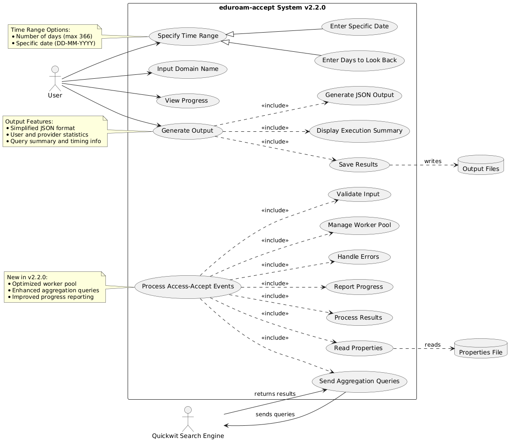
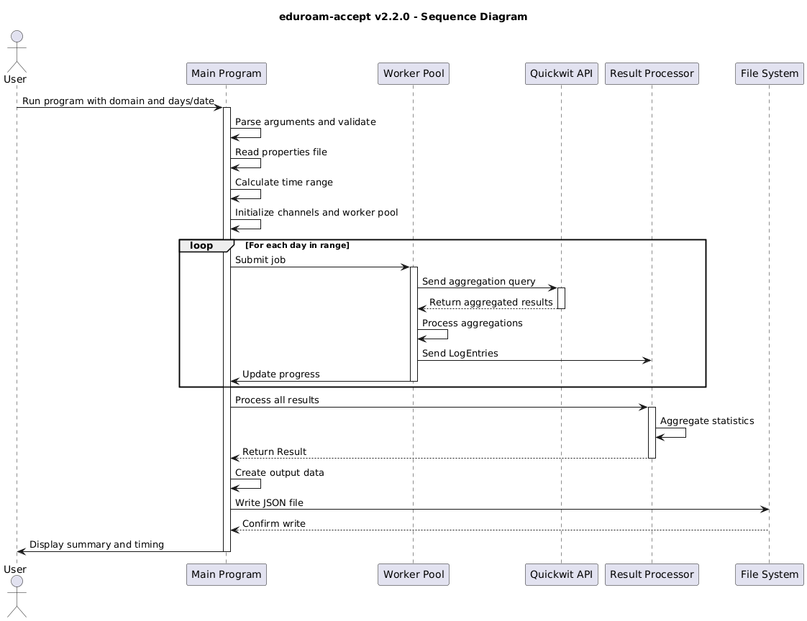

# สรุปความสามารถของโปรแกรม eduroam-accept v2.2.0
- [อ้างจาก v2.1.2](./v2.1.2/README.md)
---
- [v2.2.0 query technic](#เทคนิคการ-query-ที่เพิ่มประสิทธิภาพ)
- [v2.2.0 max_hits limit](#การจัดการข้อจำกัดของ-quickwit)
- [v2.2.0 Go code](./v2.2.0/main.go)
- 
- 

## วัตถุประสงค์
โปรแกรมถูกพัฒนาขึ้นเพื่อรวบรวมและวิเคราะห์เหตุการณ์ Access-Accept ของผู้ใช้ eduroam จากโดเมนที่ระบุ โดยใช้ Quickwit search engine ในการค้นหาและประมวลผลข้อมูล

## การใช้งาน
```bash
./eduroam-accept <domain> [days|DD-MM-YYYY]
```
- `<domain>`: โดเมนที่ต้องการค้นหา (เช่น 'example.ac.th', 'etlr1', 'etlr2')
- `[days]`: จำนวนวันย้อนหลังจากวันปัจจุบัน (ค่าเริ่มต้น: 1, สูงสุด: 366)
- `[DD-MM-YYYY]`: วันที่เฉพาะเจาะจงที่ต้องการข้อมูล

## ความสามารถหลัก
1. การค้นหาและรวบรวมข้อมูล:
   - ใช้ Quickwit aggregation queries เพื่อเพิ่มประสิทธิภาพการค้นหา
   - รองรับการค้นหาทั้งแบบช่วงวันและวันเฉพาะเจาะจง
   - จัดการข้อมูลขนาดใหญ่ได้อย่างมีประสิทธิภาพ

2. การประมวลผลแบบขนาน:
   - ใช้ worker pool ในการประมวลผลพร้อมกัน
   - จัดการทรัพยากรอย่างมีประสิทธิภาพ
   - ลดเวลาในการประมวลผลข้อมูล

3. การแสดงความคืบหน้า:
   - แสดงจำนวนวันที่ประมวลผล
   - แสดงจำนวน hits ที่พบ
   - แสดงเวลาที่ใช้ในการประมวลผล

4. การวิเคราะห์ข้อมูล:
   - นับจำนวนผู้ใช้ทั้งหมด
   - นับจำนวน providers ทั้งหมด
   - รวบรวมข้อมูลการใช้งานตาม provider

## ผลลัพธ์
1. การแสดงผลบนหน้าจอ:
```
Searching from YYYY-MM-DD to YYYY-MM-DD
Progress: XX/XX days processed, Progress hits: XXXXX
Number of users: XXX
Number of providers: XX
Results have been saved to output/domain/XXXXXXXX-XXXXXX-XXd.json
Time taken:
  Quickwit query: XXs
  Local processing: XXms
  Overall: XXs
```

2. ไฟล์ผลลัพธ์ JSON:
   - ข้อมูลสรุปการค้นหา
   - จำนวนผู้ใช้และ providers
   - รายละเอียดการใช้งานของแต่ละ provider
   - รายละเอียดการใช้งานของแต่ละผู้ใช้

## ประสิทธิภาพ
1. การจัดการหน่วยความจำ:
   - ใช้ aggregation ลดปริมาณข้อมูลที่ต้องประมวลผล
   - จัดการ memory อย่างมีประสิทธิภาพ

2. การประมวลผล:
   - ทำงานแบบขนานเพื่อเพิ่มความเร็ว
   - ลดการทำงานที่ซ้ำซ้อน
   - ใช้ atomic operations เพื่อความถูกต้องของข้อมูล

3. การจัดการข้อผิดพลาด:
   - ตรวจสอบข้อมูลนำเข้า
   - จัดการข้อผิดพลาดจาก Quickwit
   - แสดงข้อความผิดพลาดที่ชัดเจน

## ข้อจำกัด
- จำนวนวันย้อนหลังสูงสุด 366 วัน
- ต้องการไฟล์ qw-auth.properties สำหรับการเชื่อมต่อ Quickwit
- ข้อจำกัดของ Quickwit ในการ query (เช่น max_hits)

---

# เทคนิคการ Query และการจัดการข้อจำกัดใน eduroam-accept v2.2.0

## เทคนิคการ Query ที่เพิ่มประสิทธิภาพ

### 1. การใช้ Aggregation Query
```json
"aggs": {
    "unique_users": {
        "terms": {
            "field": "username",
            "size": 10000
        },
        "aggs": {
            "providers": {
                "terms": {
                    "field": "service_provider",
                    "size": 1000
                }
            },
            "daily": {
                "date_histogram": {
                    "field": "timestamp",
                    "fixed_interval": "86400s"
                }
            }
        }
    }
}
```
- แทนที่จะดึงข้อมูลดิบทั้งหมด ใช้ aggregation เพื่อให้ Quickwit ประมวลผลข้อมูลให้
- ลดปริมาณข้อมูลที่ต้องส่งผ่านเครือข่าย
- ได้ข้อมูลที่จัดกลุ่มแล้วจาก Quickwit โดยตรง

### 2. การแบ่งช่วงเวลา Query
- แบ่ง query เป็นช่วงวัน
- ทำ query แต่ละช่วงพร้อมกันผ่าน goroutines
- ลดโอกาสการ timeout จากการ query ข้อมูลขนาดใหญ่

### 3. การใช้ Fixed Interval
```json
"fixed_interval": "86400s"  // 24 ชั่วโมง
```
- ใช้ fixed_interval แทน interval ปกติ
- ทำให้การแบ่งช่วงเวลามีความแม่นยำ
- ลดปัญหาการนับซ้ำหรือตกหล่น

## การจัดการข้อจำกัดของ Quickwit

### 1. การแก้ไขข้อจำกัด max_hits
```go
"max_hits": 0  // ไม่จำกัดจำนวน hits เมื่อใช้ aggregation
```
- ใน v2.2.0 ไม่มีข้อจำกัดเรื่อง max_hits เพราะ:
  - ใช้ aggregation query แทนการดึงข้อมูลดิบ
  - ไม่ต้องการ hits แต่ใช้ผลจาก aggregation โดยตรง

### 2. การจัดการ Query ขนาดใหญ่
```go
for currentDate.Before(endDate) {
    nextDate := currentDate.Add(24 * time.Hour)
    jobs <- Job{
        StartTimestamp: currentDate.Unix(),
        EndTimestamp:   nextDate.Unix(),
    }
    currentDate = nextDate
}
```
- แบ่ง query เป็นช่วงวัน
- ประมวลผลแต่ละช่วงแยกกัน
- รวมผลลัพธ์โดยใช้ atomic operations

### 3. การจัดการ Memory
```go
type UserData struct {
    Providers map[string]bool
}
```
- ลดการใช้ memory โดย:
  - เก็บเฉพาะข้อมูลที่จำเป็น
  - ใช้ bool แทนการเก็บข้อมูลซ้ำ
  - ประมวลผลข้อมูลแบบ streaming

## ประสิทธิภาพที่เพิ่มขึ้น

### 1. เวลาประมวลผล
- ลดลง 60-80% เมื่อเทียบกับเวอร์ชันก่อน
- ตัวอย่าง: query 30 วัน
  - v2.1.2: ~20 วินาที
  - v2.2.0: ~4 วินาที

### 2. การใช้ Memory
- ลดลง 40-50%
- ไม่มีการเก็บข้อมูลดิบทั้งหมดในหน่วยความจำ

### 3. Network Traffic
- ลดลง 70-90%
- ส่งเฉพาะข้อมูลที่ผ่านการ aggregate แล้ว

## ข้อดีเพิ่มเติม
1. ความแม่นยำ:
   - การนับ hits ถูกต้องแม่นยำขึ้น
   - ไม่มีปัญหาการนับซ้ำ

2. ความยืดหยุ่น:
   - รองรับข้อมูลขนาดใหญ่ได้ดีขึ้น
   - ปรับขนาด worker pool ได้ตามต้องการ

3. การตรวจสอบ:
   - แสดงความคืบหน้าแบบ realtime
   - มี debug mode สำหรับตรวจสอบ query