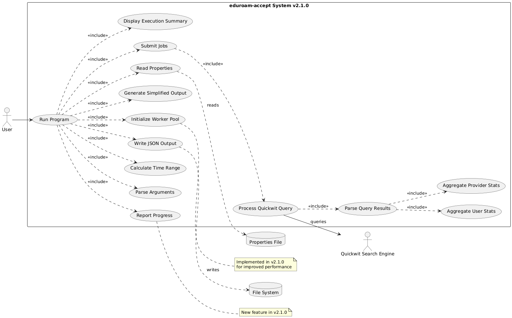
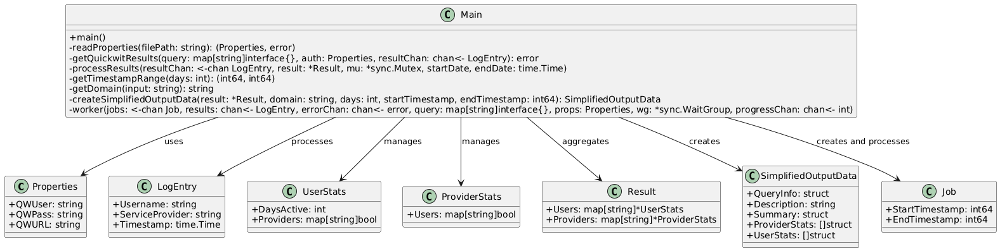

# สรุปความสามารถของโปรแกรม eduroam-accept v2.1.2
- 
- 

## วัตถุประสงค์
- รวบรวมข้อมูลเหตุการณ์ Access-Accept สำหรับผู้ใช้จากโดเมนที่ระบุ โดยใช้ Quickwit search engine
- เก็บข้อมูลในช่วงเวลาที่กำหนด ประมวลผล และส่งออกข้อมูลที่รวบรวมเป็นไฟล์ JSON

## วิธีการใช้งาน
```
./eduroam-accept <domain> [days|DD-MM-YYYY]
```
- `<domain>`: โดเมนที่ต้องการค้นหา (เช่น 'example.ac.th', 'etlr1', หรือ 'etlr2')
- `[days]`: ตัวเลือก. จำนวนวันย้อนหลังจากวันปัจจุบัน ค่าเริ่มต้นคือ 1 วัน สูงสุด 366 วัน
- `[DD-MM-YYYY]`: ตัวเลือก. วันที่เฉพาะเจาะจงที่ต้องการประมวลผลข้อมูล

## คุณสมบัติหลัก
1. ใช้ goroutines ในการค้นหาและประมวลผลข้อมูลพร้อมกันเพื่อเพิ่มประสิทธิภาพ
2. สามารถระบุช่วงเวลาได้อย่างยืดหยุ่น: ทั้งจำนวนวันหรือวันที่เฉพาะเจาะจง
3. รวบรวมข้อมูลเหตุการณ์ Access-Accept ของผู้ใช้
4. ส่งออกผลลัพธ์ในรูปแบบ JSON พร้อมข้อมูลเวลาที่ใช้ในการประมวลผล
5. โครงสร้างผลลัพธ์ที่ง่ายต่อการใช้งาน
6. รายงานความคืบหน้าระหว่างการประมวลผลข้อมูล

## ส่วนประกอบหลัก
1. การดึงข้อมูล: ใช้ Quickwit API เพื่อดึงข้อมูลเหตุการณ์ Access-Accept
2. การประมวลผลข้อมูล: รวบรวมเหตุการณ์ตามผู้ใช้และผู้ให้บริการ
3. การสร้างผลลัพธ์: สร้างโครงสร้าง JSON ที่ง่ายต่อการใช้งาน ประกอบด้วยข้อมูลการค้นหา, สรุป, สถิติผู้ให้บริการ, และสถิติผู้ใช้

## โครงสร้างผลลัพธ์
- ข้อมูลการค้นหา: โดเมน, จำนวนวัน/ช่วงวันที่
- คำอธิบายข้อมูล
- สรุป: จำนวนผู้ใช้และผู้ให้บริการทั้งหมด
- สถิติผู้ให้บริการ: รายชื่อผู้ให้บริการพร้อมจำนวนผู้ใช้และชื่อผู้ใช้
- สถิติผู้ใช้: รายชื่อผู้ใช้พร้อมจำนวนวันที่ใช้งานและผู้ให้บริการที่ใช้

## คุณสมบัติด้านประสิทธิภาพ
- ใช้ worker pools สำหรับการประมวลผลพร้อมกัน
- มีการรายงานความคืบหน้าสำหรับการค้นหาที่ใช้เวลานาน
- ปรับปรุงการใช้หน่วยความจำด้วยโครงสร้างข้อมูลเฉพาะที่ก่อนรวมเข้ากับผลลัพธ์รวม

## การจัดการข้อผิดพลาด
- ตรวจสอบข้อผิดพลาดอย่างละเอียดตลอดทั้งโปรแกรม
- บันทึกรายละเอียดสำหรับการแก้ไขปัญหา

## การปรับปรุงล่าสุด (v2.1.2)
- เพิ่มการรองรับการระบุวันที่เดี่ยวในรูปแบบ DD-MM-YYYY
- ปรับปรุงการแยกวิเคราะห์และตรวจสอบวันที่
- อัปเดตการรายงานความคืบหน้าให้รองรับทั้งช่วงวันและวันที่เฉพาะเจาะจง
- ปรับเปลี่ยนการตั้งชื่อไฟล์ผลลัพธ์สำหรับการค้นหาวันที่เฉพาะเจาะจง
- เพิ่มประสิทธิภาพการจัดการข้อผิดพลาดสำหรับการป้อนวันที่ไม่ถูกต้อง

โปรแกรม eduroam-accept เวอร์ชันนี้เป็นเครื่องมือที่ครอบคลุมสำหรับการวิเคราะห์รูปแบบการใช้งาน eduroam โดยเน้นที่ประสิทธิภาพ ความยืดหยุ่น และผลลัพธ์ที่ใช้งานง่าย