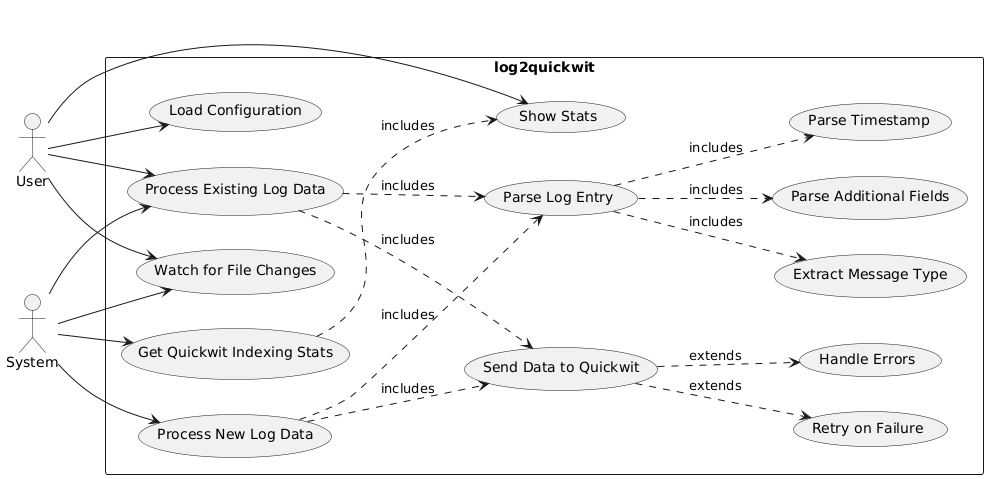
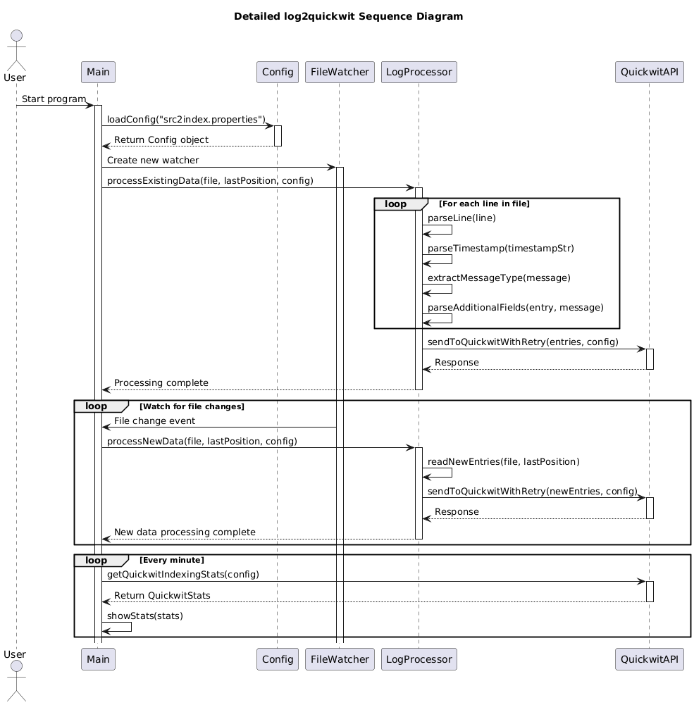

# เอกสารอธิบายโค้ด: log2quickwit v1.5.8

## สารบัญ
1. [ภาพรวม](#ภาพรวม)
2. [ส่วนประกอบหลัก](#ส่วนประกอบหลัก)
3. [โครงสร้างข้อมูล](#โครงสร้างข้อมูล)
4. [ฟังก์ชันสำคัญ](#ฟังก์ชันสำคัญ)
5. [การจัดการข้อผิดพลาด](#การจัดการข้อผิดพลาด)
6. [การกำหนดค่า](#การกำหนดค่า)

## ภาพรวม
log2quickwit เป็นโปรแกรมภาษา Go ที่ออกแบบมาเพื่ออ่านไฟล์ log จาก eduroam-th.uni.net.th, แยกวิเคราะห์ข้อมูล log และส่งข้อมูลที่วิเคราะห์แล้วไปยัง Quickwit เพื่อทำการจัดทำดัชนี โปรแกรมนี้รองรับรูปแบบ timestamp หลากหลายและมีการจัดการข้อผิดพลาดที่แข็งแกร่ง



## ส่วนประกอบหลัก

### 1. ฟังก์ชันหลัก
- อยู่ใน `main()`
- เริ่มต้นโปรแกรม, โหลดการกำหนดค่า, และเริ่มกระบวนการประมวลผล log

### 2. การประมวลผลไฟล์ Log
- `processLogFile(config Config)`: จัดการกระบวนการทำงานโดยรวมของการประมวลผลไฟล์ log
- `processExistingData(file *os.File, lastPosition *int64, config Config)`: ประมวลผลข้อมูลที่มีอยู่ในไฟล์ log
- `processNewData(file *os.File, lastPosition *int64, config Config)`: ประมวลผลข้อมูลใหม่ที่ถูกเพิ่มเข้ามาในไฟล์ log

### 3. การแยกวิเคราะห์ข้อมูล
- `parseLine(line string)`: แยกวิเคราะห์บรรทัด log เดี่ยวเป็นโครงสร้าง LogEntry
- `parseAdditionalFields(entry *LogEntry, message string)`: ดึงข้อมูลเพิ่มเติมจากข้อความ log

### 4. การเชื่อมต่อกับ Quickwit
- `sendToQuickwit(entries []LogEntry, config Config)`: ส่งรายการ log ที่วิเคราะห์แล้วไปยัง Quickwit
- `sendToQuickwitWithRetry(entries []LogEntry, config Config)`: ใช้ลอจิกการลองใหม่สำหรับการเรียก API ของ Quickwit

### 5. การติดตามและสถิติ
- `showStats(config Config)`: แสดงสถิติการจัดทำดัชนีจาก Quickwit เป็นระยะ

## โครงสร้างข้อมูล

### Config
```go
type Config struct {
    LogFilePath  string
    QuickwitURL  string
    Username     string
    Password     string
    BatchSize    int
    MaxRetries   int
}
```

### LogEntry
```go
type LogEntry struct {
    Timestamp       string    `json:"timestamp"`
    Hostname        string    `json:"hostname"`
    Process         string    `json:"process"`
    PID             int64     `json:"pid,omitempty"`
    MessageType     string    `json:"message_type"`
    DestinationIP   string    `json:"destination_ip,omitempty"`
    Username        string    `json:"username,omitempty"`
    StationID       string    `json:"station_id,omitempty"`
    Realm           string    `json:"realm,omitempty"`
    ServiceProvider string    `json:"service_provider,omitempty"`
    FullMessage     string    `json:"full_message"`
}
```

## ฟังก์ชันสำคัญ

### parseTimestamp
```go
func parseTimestamp(timestampStr string) (time.Time, error)
```
แยกวิเคราะห์รูปแบบ timestamp ต่างๆ รวมถึง ISO8601 และรูปแบบดั้งเดิม

### parseLine
```go
func parseLine(line string) (LogEntry, error)
```
แยกวิเคราะห์บรรทัด log เดี่ยวและดึงข้อมูลที่เกี่ยวข้องเข้าสู่โครงสร้าง LogEntry

### parseAdditionalFields
```go
func parseAdditionalFields(entry *LogEntry, message string)
```
ดึงข้อมูลเพิ่มเติมจากข้อความ log เช่น username, stationid, realm เป็นต้น

### sendToQuickwit
```go
func sendToQuickwit(entries []LogEntry, config Config) error
```
ส่งรายการ log ที่วิเคราะห์แล้วไปยัง Quickwit เพื่อจัดทำดัชนี

## การจัดการข้อผิดพลาด
- โปรแกรมมีการจัดการข้อผิดพลาดอย่างครอบคลุมตลอดการทำงาน
- ข้อผิดพลาดในการแยกวิเคราะห์จะถูกบันทึกพร้อมข้อมูลโดยละเอียดเพื่อการแก้ไขปัญหา
- ข้อผิดพลาดที่เกี่ยวข้องกับเครือข่ายระหว่างการเรียก API ของ Quickwit จะถูกจัดการด้วยกลไกการลองใหม่

## การกำหนดค่า
โปรแกรมใช้ไฟล์กำหนดค่า (ค่าเริ่มต้น: `src2index.properties`) ด้วยพารามิเตอร์ต่อไปนี้:
- `logFilePath`: เส้นทางไปยังไฟล์ log ที่จะประมวลผล
- `quickwitURL`: URL ของเซิร์ฟเวอร์ Quickwit
- `username`: ชื่อผู้ใช้สำหรับการยืนยันตัวตนกับ Quickwit
- `password`: รหัสผ่านสำหรับการยืนยันตัวตนกับ Quickwit
- `batchSize`: จำนวนรายการ log ที่จะส่งในแต่ละครั้ง (ค่าเริ่มต้น: 30000)
- `maxRetries`: จำนวนครั้งสูงสุดในการลองใหม่สำหรับคำขอที่ล้มเหลว (ค่าเริ่มต้น: 3)

การกำหนดค่ายังสามารถถูกแทนที่ได้โดยใช้ตัวเลือกบรรทัดคำสั่ง